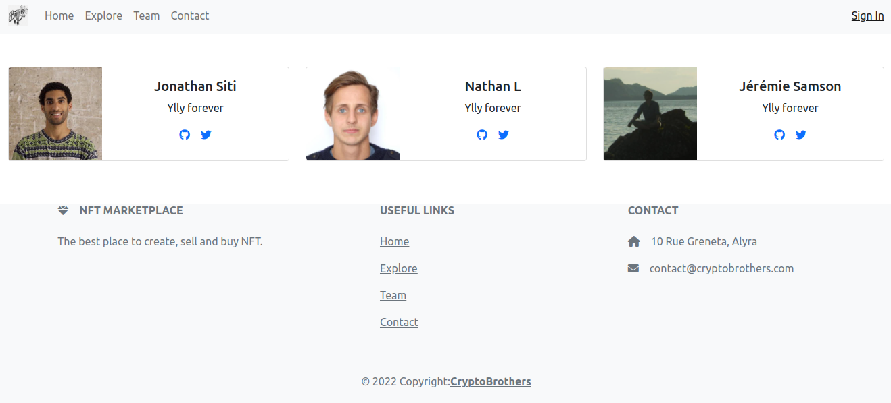

[](https://coveralls.io/github/JeremieSamson/alyra_nft?branch=main)

# NFT Markeplace



## Environments

- Contract is deployed here:
- App is deployed here:


## Development

### Clone the project

```
git clone git@github.com:JeremieSamson/solidity_docker_bootstrap.git
```

Then you can use make commands

```
// This will build images, up them and install node_modules
make install

// This will launch migration
make truffle migrate

// This will launch tests
make truffle test
```

### React

To launch react, you just need to do as follow
```
make react-start
```

Then go to [https://localhost:3000](https://localhost:3000)

## Lint

### [ESLint](https://eslint.org/)

ESLint let you find and fix problems in your javascript code.
It is a nice plugin to lint your code.

```
// To see errors
make esnlint

// To fix errors
make esnlintfix
```

### [Sodium/Ethlint](https://github.com/duaraghav8/Ethlint)

Customizable linter for ethereum's solidity smart contract.

```
// To see errors
make solium

// To fix errors
make soliumfix
```

### Contributors

This project has been made by a group of three for the alyra NFT project. Work repartition has been done like this:
- @Jonacity: Back/Solidity
- @NaLe3: Back/Tests
- @JSamson76: Front/React